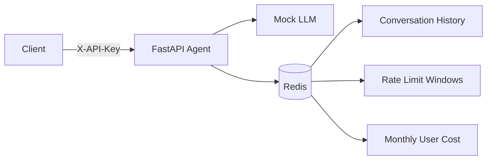

# Lab 12 Complete Production Agent

Production-ready FastAPI agent with Redis-backed conversation history, per-user rate limiting,
and per-user monthly cost protection.

## Requirements Covered

- Multi-stage Docker image under 500 MB
- Configuration from environment variables
- API key authentication
- Sliding-window rate limit: 10 requests/minute per user
- Cost guard: USD 10/month per user
- Redis-backed conversation history
- Health and readiness probes
- Graceful shutdown and structured JSON logs
- Railway and Render deployment configuration

## Architecture



## Run Locally

```bash
docker compose up --build -d
curl http://localhost:8000/health
curl http://localhost:8000/ready
curl -X POST http://localhost:8000/ask \
  -H "X-API-Key: dev-key-change-me" \
  -H "Content-Type: application/json" \
  -d '{"user_id":"alice","question":"Hello"}'
```

The optional `.env.local` file can override values from `.env.example`.

## Tests

```bash
python -m unittest -v test_app.py
python check_production_ready.py
docker compose config --quiet
```

## API

- `POST /ask`: authenticated agent request with `user_id` and `question`
- `GET /history/{user_id}`: authenticated conversation history
- `GET /health`: public liveness probe
- `GET /ready`: public readiness probe
- `GET /metrics?user_id=alice`: authenticated usage metrics
- `/docs`: OpenAPI documentation outside production

## Production Variables

Set `ENVIRONMENT=production`, `AGENT_API_KEY`, `JWT_SECRET`, and `REDIS_URL`. Optional settings
include `RATE_LIMIT_PER_MINUTE`, `MONTHLY_BUDGET_USD`, `ALLOWED_ORIGINS`, and `OPENAI_API_KEY`.
