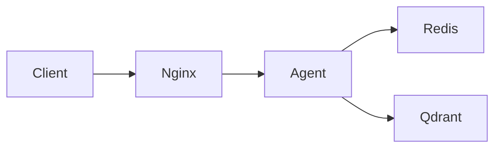

# Day 12 Lab - Mission Answers

- Student: Pham Tien Hung
- Student ID: 2A202600576
- Verification date: June 12, 2026

## Part 1: Localhost vs Production

### Exercise 1.1: Anti-patterns found

1. API key and database credentials are hardcoded.
2. Host and port are hardcoded.
3. Debug reload is always enabled.
4. Secrets are printed to logs.
5. Health and readiness checks are missing.
6. There is no graceful shutdown or centralized configuration.

### Exercise 1.2: Basic version test

The basic app returned HTTP `200` from `/` and `/ask`. It works locally but exposes secrets in
logs and lacks production health/configuration behavior.

### Exercise 1.3: Comparison table

| Feature | Develop | Production | Why important? |
|---|---|---|---|
| Config | Hardcoded | Environment variables | One image works across environments |
| Health checks | Missing | `/health` and `/ready` | Platforms detect unhealthy instances |
| Logging | `print()` with secrets | Structured JSON without secrets | Searchable and safer logs |
| Shutdown | Abrupt | Lifespan cleanup and SIGTERM | In-flight requests can finish |

## Part 2: Docker

### Exercise 2.1: Dockerfile questions

1. Base image: `python:3.11`.
2. Working directory: `/app`.
3. Requirements are copied first so dependency installation remains cached when source changes.
4. `CMD` supplies a replaceable default command; `ENTRYPOINT` defines the normally fixed executable.

### Exercise 2.2: Build and run

The develop image built and ran successfully. `/health` returned HTTP `200`.

### Exercise 2.3: Image size comparison

- Develop: `1.66GB`
- Production: `236MB`
- Final complete image: `247MB`
- Production is approximately `85.8%` smaller than develop and is below the required `500MB`.

The builder stage contains compilers and installs dependencies. The runtime stage contains only
the installed packages and application, and runs as a non-root user.

### Exercise 2.4: Docker Compose architecture



Compose service names provide private DNS between containers.

## Part 3: Cloud Deployment

### Exercise 3.1: Railway deployment

- Railway configuration exists at `06-lab-complete/railway.toml`.
- Public deployment is not complete because Railway credentials and CLI are unavailable.

### Exercise 3.2: Render deployment

Render uses a Blueprint YAML containing service and environment-variable definitions. Railway uses
TOML focused on build/start/health behavior.

### Exercise 3.3: Cloud Run

`cloudbuild.yaml` defines the CI/CD build and deployment pipeline. `service.yaml` defines the Cloud
Run runtime service.

## Part 4: API Security

### Exercise 4.1: API key authentication

- Missing or wrong `X-API-Key`: HTTP `401`.
- Correct key: HTTP `200`.
- Rotate the key by updating `AGENT_API_KEY` and redeploying.

### Exercise 4.2: JWT authentication

The advanced Part 4 flow exchanges demo credentials for a signed, expiring JWT. Protected
endpoints verify the signature, expiry, subject, and role.

### Exercise 4.3: Rate limiting

The final app uses a Redis-backed atomic sliding window. The first 10 requests per minute per
`user_id` are accepted; later requests return HTTP `429`.

### Exercise 4.4: Cost guard

The final app uses an atomic Redis operation to track each user's monthly spending. Spending keys
include the user and current month, expire automatically, and return HTTP `402` before the
configured USD 10 monthly limit is exceeded.

### Part 4 test results

```text
Authentication without key: 401
Authentication with key: 200
Rate limit exceeded: 429
Monthly budget exceeded: 402
```

## Part 5: Scaling and Reliability

### Exercise 5.1: Health checks

`/health` returns liveness information. `/ready` returns `503` when the app or configured Redis
dependency is unavailable.

### Exercise 5.2: Graceful shutdown

FastAPI lifespan cleanup and Uvicorn's graceful shutdown timeout handle SIGTERM. The custom signal
handler was removed because it intercepted Uvicorn's shutdown handling.

### Exercise 5.3: Stateless design

Conversation history, rate-limit windows, and monthly cost state are stored in Redis in production.

### Exercise 5.4: Load balancing

Nginx routes requests to scaled agent instances. Shared Redis state allows any instance to handle
the next request.

### Exercise 5.5: Stateless test

The Part 5 `test_stateless.py` script creates a session, sends multiple requests, and verifies the
history remains available across instances.

## Part 6: Final Project

The final project is in `06-lab-complete/`. It includes:

- REST agent with Redis-backed conversation history
- API key authentication
- Atomic Redis rate limit: 10 requests/minute per user
- Atomic Redis cost guard: USD 10/month per user
- Health/readiness, structured logs, graceful shutdown
- Multi-stage Docker image and Compose stack
- Railway/Render configuration and OpenAPI docs

### Local verification results

```text
Behavior tests: 8/8 passed
Production readiness checks: 27/27 passed
Python compileall: passed
Docker Compose config: passed
Final Docker image: 247MB
Stateless two-instance Redis failover: passed
Redis rate-limit integration: 200 x 10, then 429
Redis monthly-budget integration: 402 when exhausted
Graceful SIGTERM shutdown: exit code 0 with shutdown lifecycle logs
```
